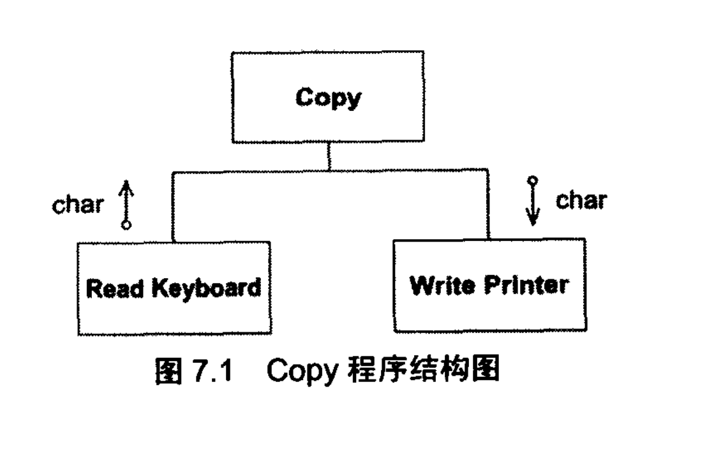
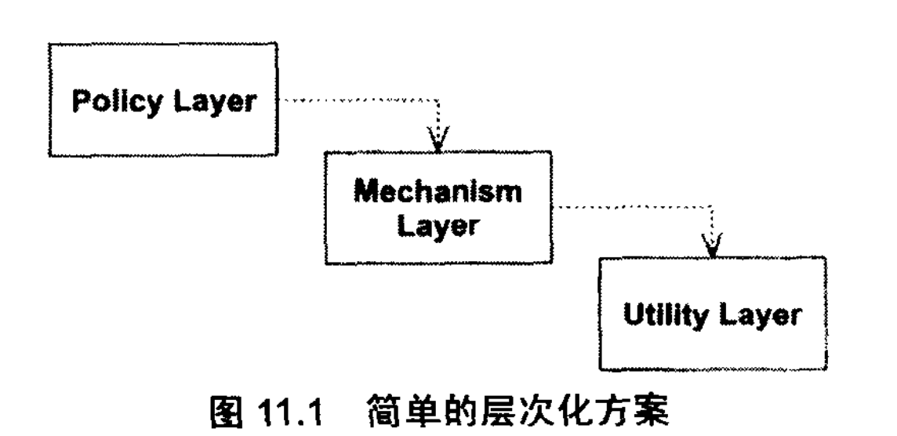
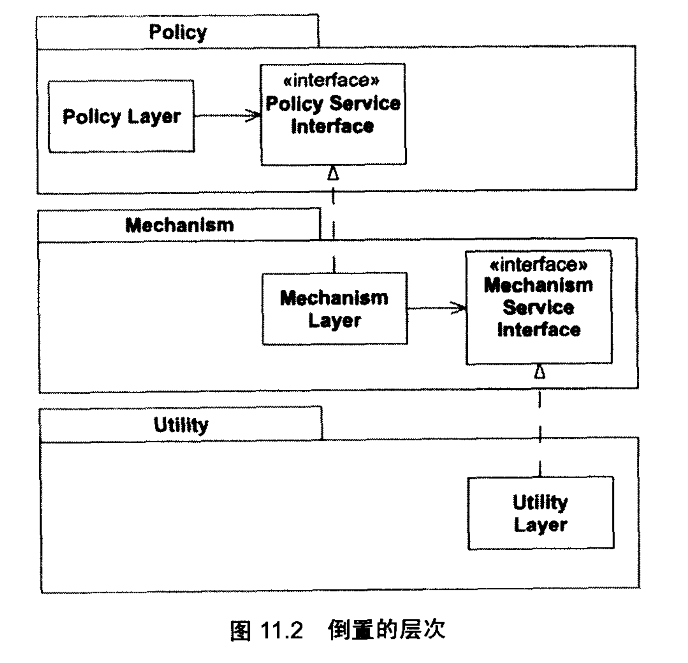
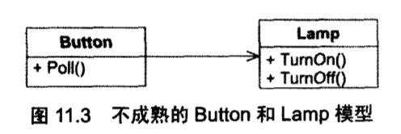
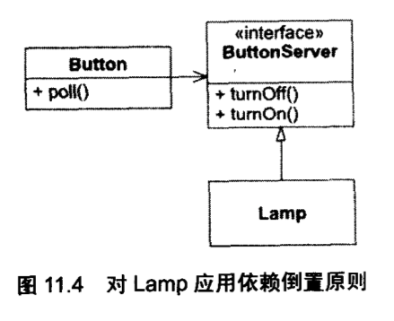
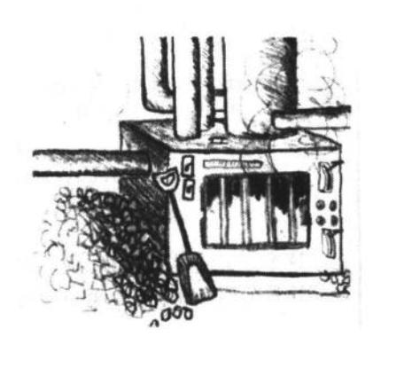
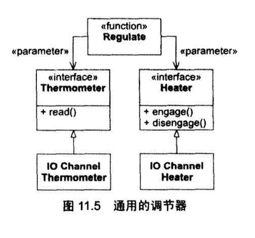

# 依赖倒置原则（DIP）

## 原理

1. 高层模块不应该依赖于低层模块。二者都应该依赖于抽象。
2. 抽象不应该依赖于细节。细节应该依赖于抽象。

为什么这个原则中使用了“倒置”这个词？
	
	举例copy程序。

	
	初始设计
	程序7.1:
	void Copy()
	{
		int c;
		while ((c=RdKbd()) != EOF))
			WrtPrt(c);
	}
	
	需求在变化，老板希望从纸带读入机中读入信息：
	程序7.2 Copy程序的第一次修改结果
	bool ptFlag = false;
	// remember to reset this flag
	void Copy()
	{
		int c;
		while ((c=(ptFlag ? Rdpt() : RdKbd()) != EOF))
			WrtPrt(c);
	}
	
	得寸进尺，老板希望Copy程序可以输出到纸带穿孔机上
	程序7.3
	bool ptFlag = false;
	bool punchFlag = false;
	// remember to reset these flags
	void Copy()
	{
		int c;
		while ((c = (ptFlag ? Rdpt() : RdKbd())) != EOF))
			punchFlag ? WrtPunch(c) : WrtPrc(c);
	}

	期待变化
	上面的程序已经出现了僵化性、脆弱性、牢固性、不必要的复杂性、不必要的重复性及晦涩性的症状。
	

	Copy的敏捷设计版本
	class Reader
	{
		public:
			virtual int read() = 0;
	}
	
	class	KeyboardReader : public Reader
	{
		public:
			virtual int read() { return RdKbd(); }
	}
	
	KeyboardReader GdefaultReader;
	void Copy(Reader &reader = GdefaultReader)
	{
		int c;
		while ((c = reader.read()) != EOF)
			WrtPtr(c);
	}
	
	上面遵循了OCP原则。无需修改Copy程序就可以使用老板要求的各种新的输入设备。
	但请注意，团队不是一开始设计该模块时就视图预测程序将如何变化。相反，先以最简单的方法编写。
	直到需求最终变化时，才修改模块的设计，使之对该种变化保持弹性。
	
高层模块包含了一个应用程序中的重要的策略选择和业务模型。
重用高层的策略设置模块（框架设计的核心原则）。

## 层次化

高层依赖了低层。下层修改影响上层。

倒置的层次，倒置依赖关系，倒置接口所有权。

#### 倒置的接口所有权

结构 更灵活、更持久、更易改变

#### 依赖于抽象

## 一个简单的例子
使用一个存在的类向另一个类发送消息。Button对象依赖Lamp对象的例子。

	public class Button
	{
		private Lamp itsLamp;
		public void poll()
		{
			if ( /* some condition */ )
				itsLamp.turnOn();
		}
	}

## 熔炉示例
考虑一个控制熔炉调节器的软件。

	#define THERMOMETER  0x86
	#define FURNACE		0x87
	#define ENGAGE		1
	#define DISENGAGE	0
	
	void Regulate(double minTemp, double maxTemp)
	{
		for (;;)
		{
			while (in(THERMONETER) > minTemp)
				wait(1);
			out (FURNACE, ENGAGE);
			
			while (in(THERMONETER) < maxTemp)
				wait(1);
			out (FURNACE, DISENGAGE);
		}
	}
	

	void Regulate(Thermometer &t, Heater &h, double minTemp, double maxTemp)
	{
		for (;;)
		{
			while (t.Read() > minTemp)
				wait(1);
			h.Engage();
			
			while (t.Read() < maxTemp)
				wait(1);
			h.Disengage();
		}
	}
	
## 结论

1. 倒置依赖关系结构，使得细节和策略都依赖于抽象，细节改变不影响策略。
2. 依赖关系的倒置是好的面向对象设计的标志所在。
3. 使用依赖倒置原则的代码拥有更好的重用性、更好的面对变化能力、更容易被维护。
